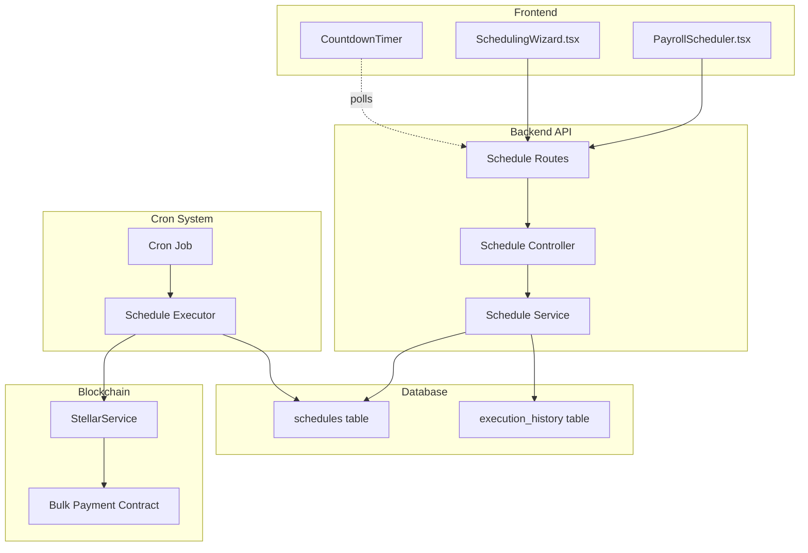

# Design Document: Payroll Scheduler Backend Wiring

## Overview

This feature implements the backend infrastructure to support automated payroll scheduling. The system consists of three main components:

1. **REST API Layer**: Express.js endpoints for schedule CRUD operations
2. **Database Layer**: PostgreSQL tables for persisting schedule configurations and execution history
3. **Cron Job Executor**: Node-based scheduler that monitors due schedules and triggers Stellar blockchain payments

The design integrates with existing frontend components (PayrollScheduler.tsx, SchedulingWizard.tsx) and leverages the current StellarService for blockchain interactions. The system supports both one-time and recurring payment schedules with real-time status updates.

### Key Design Decisions

- **Cron Implementation**: Using `node-cron` library for reliable, in-process scheduling rather than external cron daemons
- **Time Calculation**: Server-side calculation of next run timestamps to ensure consistency across timezones
- **Transaction Atomicity**: Database transactions for schedule creation/deletion to maintain data integrity
- **Error Recovery**: Failed payment executions are logged but don't block future schedule runs

## Architecture

### System Components



### Data Flow

**Schedule Creation Flow:**

1. User configures schedule in SchedulingWizard
2. Frontend POST to `/api/schedules` with schedule configuration
3. Controller validates request and extracts user context
4. Service calculates next_run_timestamp based on frequency/time
5. Database persists schedule with status 'active'
6. Response includes schedule ID and next_run_timestamp
7. Frontend displays countdown timer

**Schedule Execution Flow:**

1. Cron job runs every minute
2. Queries database for schedules where `next_run_timestamp <= NOW() AND status = 'active'`
3. For each due schedule:
   - Retrieves payment configuration
   - Invokes StellarService to execute bulk payment
   - Records execution in execution_history table
   - Updates schedule: one-time → 'completed', recurring → calculates new next_run_timestamp
4. Logs errors for failed executions without blocking other schedules

## Components and Interfaces

### Database Schema

#### schedules table

```sql
CREATE TABLE schedules (
  id SERIAL PRIMARY KEY,
  organization_id INTEGER NOT NULL REFERENCES organizations(id) ON DELETE CASCADE,
  user_id INTEGER NOT NULL,

  -- Schedule configuration
  frequency VARCHAR(20) NOT NULL CHECK (frequency IN ('once', 'weekly', 'biweekly', 'monthly')),
  time_of_day TIME NOT NULL,
  start_date DATE NOT NULL,
  end_date DATE,

  -- Payment configuration (stored as JSONB for flexibility)
  payment_config JSONB NOT NULL,

  -- Execution tracking
  next_run_timestamp TIMESTAMP NOT NULL,
  last_run_timestamp TIMESTAMP,
  status VARCHAR(20) DEFAULT 'active' CHECK (status IN ('active', 'completed', 'cancelled', 'failed')),

  -- Metadata
  created_at TIMESTAMP DEFAULT CURRENT_TIMESTAMP,
  updated_at TIMESTAMP DEFAULT CURRENT_TIMESTAMP
);

CREATE INDEX idx_schedules_next_run ON schedules(next_run_timestamp, status);
CREATE INDEX idx_schedules_org_id ON schedules(organization_id);
CREATE INDEX idx_schedules_status ON schedules(status);
```

#### execution_history table

```sql
CREATE TABLE execution_history (
  id SERIAL PRIMARY KEY,
  schedule_id INTEGER NOT NULL REFERENCES schedules(id) ON DELETE CASCADE,

  -- Execution details
  executed_at TIMESTAMP DEFAULT CURRENT_TIMESTAMP,
  status VARCHAR(20) NOT NULL CHECK (status IN ('success', 'failed', 'partial')),

  -- Blockchain transaction details
  transaction_hash VARCHAR(64),
  transaction_result JSONB,

  -- Error tracking
  error_message TEXT,
  error_details JSONB,

  -- Metadata
  created_at TIMESTAMP DEFAULT CURRENT_TIMESTAMP
);

CREATE INDEX idx_execution_schedule_id ON execution_history(schedule_id);
CREATE INDEX idx_execution_status ON execution_history(status);
CREATE INDEX idx_execution_executed_at ON execution_history(executed_at);
```

### API Endpoints

#### POST /api/schedules

Creates a new payroll schedule.

**Request Body:**

```typescript
interface CreateScheduleRequest {
  frequency: "once" | "weekly" | "biweekly" | "monthly";
  timeOfDay: string; // HH:MM format
  startDate: string; // ISO date
  endDate?: string; // ISO date, optional for recurring
  paymentConfig: {
    recipients: Array<{
      walletAddress: string;
      amount: string;
      assetCode: string;
    }>;
    memo?: string;
  };
}
```

**Response (201):**

```typescript
interface CreateScheduleResponse {
  id: number;
  frequency: string;
  timeOfDay: string;
  startDate: string;
  endDate?: string;
  nextRunTimestamp: string; // ISO timestamp
  status: string;
  createdAt: string;
}
```

**Error Responses:**

- 400: Invalid request body or validation failure
- 401: Authentication required
- 403: Insufficient permissions
- 500: Server error

#### GET /api/schedules

Retrieves all active schedules for the authenticated user's organization.

**Query Parameters:**

- `status` (optional): Filter by status (active, completed, cancelled)
- `page` (optional): Page number for pagination
- `limit` (optional): Items per page

**Response (200):**

```typescript
interface GetSchedulesResponse {
  schedules: Array<{
    id: number;
    frequency: string;
    timeOfDay: string;
    startDate: string;
    endDate?: string;
    nextRunTimestamp: string;
    lastRunTimestamp?: string;
    status: string;
    paymentConfig: object;
    createdAt: string;
  }>;
  pagination: {
    page: number;
    limit: number;
    total: number;
  };
}
```

#### DELETE /api/schedules/:id

Cancels a pending schedule.

**Path Parameters:**

- `id`: Schedule ID

**Response:**

- 204: Successfully cancelled
- 404: Schedule not found
- 403: User doesn't own this schedule
- 409: Schedule already executed/cancelled

### Service Layer

#### ScheduleService

```typescript
class ScheduleService {
  async createSchedule(
    organizationId: number,
    userId: number,
    scheduleData: CreateScheduleRequest,
  ): Promise<Schedule>;

  async getActiveSchedules(
    organizationId: number,
    filters?: ScheduleFilters,
  ): Promise<Schedule[]>;

  async cancelSchedule(
    scheduleId: number,
    organizationId: number,
  ): Promise<void>;

  calculateNextRun(
    frequency: string,
    timeOfDay: string,
    startDate: Date,
    lastRun?: Date,
  ): Date;

  async updateAfterExecution(
    scheduleId: number,
    executionResult: ExecutionResult,
  ): Promise<void>;
}
```

#### ScheduleExecutor

```typescript
class ScheduleExecutor {
  initialize(): void;
  async processDueSchedules(): Promise<void>;
  async executeSchedule(schedule: Schedule): Promise<ExecutionResult>;
  async recordExecution(
    scheduleId: number,
    result: ExecutionResult,
  ): Promise<void>;
}
```

### Integration with StellarService

The ScheduleExecutor will use the existing StellarService to execute bulk payments:

```typescript
// In ScheduleExecutor.executeSchedule()
const paymentConfig = schedule.payment_config;
const operations = paymentConfig.recipients.map((recipient) =>
  Operation.payment({
    destination: recipient.walletAddress,
    asset: new Asset(recipient.assetCode, ISSUER_PUBLIC_KEY),
    amount: recipient.amount,
  }),
);

const transaction = await StellarService.buildTransaction(
  SOURCE_PUBLIC_KEY,
  operations,
  { memo: Memo.text(paymentConfig.memo || "") },
);

const signedTx = StellarService.signTransaction(transaction, sourceKeypair);
const result = await StellarService.submitTransaction(signedTx);
```

## Data Models

### TypeScript Interfaces

```typescript
interface Schedule {
  id: number;
  organizationId: number;
  userId: number;
  frequency: "once" | "weekly" | "biweekly" | "monthly";
  timeOfDay: string;
  startDate: Date;
  endDate?: Date;
  paymentConfig: PaymentConfig;
  nextRunTimestamp: Date;
  lastRunTimestamp?: Date;
  status: "active" | "completed" | "cancelled" | "failed";
  createdAt: Date;
  updatedAt: Date;
}

interface PaymentConfig {
  recipients: PaymentRecipient[];
  memo?: string;
}

interface PaymentRecipient {
  walletAddress: string;
  amount: string;
  assetCode: string;
}

interface ExecutionHistory {
  id: number;
  scheduleId: number;
  executedAt: Date;
  status: "success" | "failed" | "partial";
  transactionHash?: string;
  transactionResult?: object;
  errorMessage?: string;
  errorDetails?: object;
  createdAt: Date;
}

interface ExecutionResult {
  success: boolean;
  transactionHash?: string;
  error?: {
    message: string;
    details?: object;
  };
}
```

## Correctness Properties

_A property is a characteristic or behavior that should hold true across all valid executions of a system-essentially, a formal statement about what the system should do. Properties serve as the bridge between human-readable specifications and machine-verifiable correctness guarantees._

### Property 1: Schedule Validation

_For any_ schedule configuration submitted to the API, the validation logic should correctly accept valid configurations and reject invalid configurations with a 400 status and descriptive error messages.

**Validates: Requirements 1.2, 1.5**

### Property 2: Schedule Persistence Round Trip

_For any_ valid schedule configuration, after successful creation via POST /api/schedules, the returned schedule object should contain a unique identifier, a calculated next_run_timestamp, and all the submitted configuration data.

**Validates: Requirements 1.3, 1.4**

### Property 3: Active Schedule Retrieval Completeness

_For any_ set of schedules in the database with mixed statuses, a GET request to /api/schedules should return only schedules with status 'active', and each returned schedule should include its identifier, configuration, and a calculated next_run_timestamp.

**Validates: Requirements 2.2, 2.3, 2.4**

### Property 4: Next Run Timestamp Calculation

_For any_ schedule with a given frequency (once, weekly, biweekly, monthly), time of day, and start date, the calculated next_run_timestamp should correctly represent the next occurrence according to the frequency rules and should always be in the future relative to the current time (for new schedules) or relative to the last run time (for recurring schedules).

**Validates: Requirements 2.3**

### Property 5: Schedule Deletion Success

_For any_ existing active schedule, a DELETE request to /api/schedules/:id with the correct schedule ID should return a 204 status, and subsequent queries should not return that schedule in the active schedules list.

**Validates: Requirements 3.2, 3.3**

### Property 6: Schedule Deletion Not Found

_For any_ non-existent schedule ID, a DELETE request to /api/schedules/:id should return a 404 error.

**Validates: Requirements 3.4**

### Property 7: Due Schedule Identification

_For any_ set of schedules with various next_run_timestamps, the cron job's query logic should retrieve exactly those schedules where next_run_timestamp <= current_time AND status = 'active', excluding all others.

**Validates: Requirements 5.2**

### Property 8: Payment Invocation Parameters

_For any_ due schedule, when the cron job executes the payment, the parameters passed to the StellarService should exactly match the payment_config stored in the schedule (recipients, amounts, asset codes, memo).

**Validates: Requirements 5.3**

### Property 9: Successful Execution Recording

_For any_ schedule execution that succeeds (payment transaction confirmed on blockchain), the execution_history table should contain a record with status 'success', the transaction hash, and the schedule's last_run_timestamp should be updated to the execution time.

**Validates: Requirements 5.4**

### Property 10: Failed Execution Recording

_For any_ schedule execution that fails (payment transaction rejected or error occurs), the execution_history table should contain a record with status 'failed', an error message, and the schedule status should be marked as 'failed' to prevent retry loops.

**Validates: Requirements 5.5**

### Property 11: One-Time Schedule Completion

_For any_ schedule with frequency 'once', after successful execution, the schedule status should be updated to 'completed' and it should not appear in subsequent queries for due schedules.

**Validates: Requirements 5.6**

### Property 12: Recurring Schedule Next Run Update

_For any_ schedule with frequency 'weekly', 'biweekly', or 'monthly', after successful execution, the next_run_timestamp should be recalculated to the next occurrence based on the frequency, and the schedule status should remain 'active'.

**Validates: Requirements 5.7**

### Property 13: Malformed Request Handling

_For any_ request with malformed JSON or missing required fields, the API should return a 400 error with a descriptive message indicating what is wrong with the request.

**Validates: Requirements 6.2**

### Property 14: Authorization Enforcement

_For any_ schedule, when a user attempts to access or modify a schedule that belongs to a different organization, the API should return a 403 error regardless of whether the schedule exists.

**Validates: Requirements 6.4**

## Error Handling

### API Error Handling Strategy

The API implements comprehensive error handling at multiple layers:

**Validation Layer:**

- Request body validation using Joi or Zod schemas
- Type checking for all required fields
- Business rule validation (e.g., start_date not in past, valid frequency values)
- Returns 400 with structured error messages listing all validation failures

**Authentication/Authorization Layer:**

- JWT token validation via existing auth middleware
- Organization context extraction from authenticated user
- Schedule ownership verification before any read/update/delete operation
- Returns 401 for missing/invalid auth, 403 for insufficient permissions

**Database Layer:**

- Connection pool error handling with retry logic
- Transaction rollback on any failure during multi-step operations
- Deadlock detection and retry for concurrent schedule modifications
- Returns 503 for database unavailability, 500 for unexpected database errors

**Blockchain Layer:**

- Stellar transaction simulation before submission (using existing pattern)
- Network timeout handling with configurable retry attempts
- Transaction result parsing to distinguish between different failure types
- Errors logged to execution_history with full details for debugging

### Cron Job Error Handling

**Isolation:** Each schedule execution runs in isolation - failure of one schedule doesn't affect others

**Retry Strategy:**

- Failed schedules are marked with status 'failed' and not retried automatically
- Manual intervention required to investigate and reschedule
- Prevents infinite retry loops that could drain funds or spam the network

**Logging:**

- All execution attempts logged to execution_history table
- Error details include full stack trace and Stellar transaction result XDR
- Separate application logs for cron job health monitoring

**Monitoring:**

- Cron job heartbeat logged every execution cycle
- Metrics tracked: schedules processed, successes, failures, execution time
- Alerts configured for: consecutive failures, execution time exceeding threshold, no schedules processed for extended period

### Frontend Error Handling

The API provides structured error responses to enable meaningful user feedback:

```typescript
interface ErrorResponse {
  error: {
    code: string; // Machine-readable error code
    message: string; // Human-readable message
    details?: object; // Additional context (e.g., validation errors)
  };
}
```

**Error Codes:**

- `VALIDATION_ERROR`: Request validation failed
- `SCHEDULE_NOT_FOUND`: Schedule ID doesn't exist
- `UNAUTHORIZED`: Authentication required
- `FORBIDDEN`: Insufficient permissions
- `DATABASE_ERROR`: Database operation failed
- `BLOCKCHAIN_ERROR`: Stellar transaction failed
- `INTERNAL_ERROR`: Unexpected server error

## Testing Strategy

### Dual Testing Approach

This feature requires both unit tests and property-based tests to ensure comprehensive coverage:

**Unit Tests** focus on:

- Specific examples of schedule creation with known inputs/outputs
- Edge cases like empty schedule lists, schedules at boundary times
- Error conditions like database connection failures, invalid auth tokens
- Integration points between controller, service, and database layers

**Property-Based Tests** focus on:

- Universal properties that hold across all valid schedule configurations
- Validation logic correctness across the input space
- Next run timestamp calculation accuracy for all frequency types
- Schedule lifecycle state transitions (active → completed/failed)

### Property-Based Testing Configuration

**Library:** `fast-check` for TypeScript/Node.js

**Test Configuration:**

- Minimum 100 iterations per property test
- Custom generators for schedule configurations, timestamps, payment configs
- Shrinking enabled to find minimal failing examples

**Property Test Tags:**
Each property test must reference its design document property using this format:

```typescript
// Feature: payroll-scheduler-backend-wiring, Property 1: Schedule Validation
test("validates schedule configurations correctly", async () => {
  await fc.assert(
    fc.asyncProperty(scheduleConfigArbitrary, async (config) => {
      // Test implementation
    }),
    { numRuns: 100 },
  );
});
```

### Unit Testing Strategy

**Controller Tests:**

- Mock service layer to test request/response handling
- Verify correct status codes for success and error cases
- Test authentication/authorization middleware integration
- Validate request body parsing and error formatting

**Service Tests:**

- Mock database layer to test business logic
- Test next run timestamp calculation with known dates
- Verify schedule state transitions
- Test transaction handling (rollback on errors)

**Cron Job Tests:**

- Mock database and StellarService
- Test due schedule identification logic
- Verify payment parameter extraction
- Test execution history recording
- Verify state updates for one-time vs recurring schedules

**Integration Tests:**

- Test full API flow with real database (test database)
- Verify database schema and constraints
- Test concurrent schedule operations
- Verify transaction isolation

### Test Data Generators

For property-based tests, we need generators for:

**Schedule Configurations:**

```typescript
const scheduleConfigArbitrary = fc.record({
  frequency: fc.constantFrom("once", "weekly", "biweekly", "monthly"),
  timeOfDay: fc
    .tuple(fc.integer(0, 23), fc.integer(0, 59))
    .map(
      ([h, m]) =>
        `${h.toString().padStart(2, "0")}:${m.toString().padStart(2, "0")}`,
    ),
  startDate: fc
    .date({ min: new Date() })
    .map((d) => d.toISOString().split("T")[0]),
  paymentConfig: fc.record({
    recipients: fc.array(
      fc.record({
        walletAddress: stellarPublicKeyArbitrary,
        amount: fc.double(0.01, 1000000).map((n) => n.toFixed(2)),
        assetCode: fc.constantFrom("USDC", "XLM", "EURC"),
      }),
      1,
      100,
    ),
    memo: fc.option(fc.string(0, 28)),
  }),
});
```

**Invalid Configurations:**

```typescript
const invalidScheduleConfigArbitrary = fc.oneof(
  fc.record({ frequency: fc.string() }), // Missing other fields
  fc.record({
    ...validFields,
    frequency: fc
      .string()
      .filter((s) => !["once", "weekly", "biweekly", "monthly"].includes(s)),
  }),
  fc.record({ ...validFields, timeOfDay: fc.string() }),
  fc.record({
    ...validFields,
    startDate: fc.date({ max: new Date(Date.now() - 86400000) }),
  }),
  fc.record({ ...validFields, paymentConfig: { recipients: [] } }),
);
```

### Coverage Goals

- **Line Coverage:** Minimum 80% for all service and controller code
- **Branch Coverage:** Minimum 75% for error handling paths
- **Property Coverage:** All testable acceptance criteria covered by at least one property test
- **Integration Coverage:** All API endpoints tested with real database

### Test Execution

**Development:**

```bash
npm test -- --watch
```

**CI/CD:**

```bash
npm test -- --coverage --ci
npm run test:integration
npm run test:properties -- --numRuns=1000
```

**Pre-deployment:**

- All unit tests must pass
- All property tests must pass with 1000 iterations
- Integration tests must pass against staging database
- No critical security vulnerabilities in dependencies
